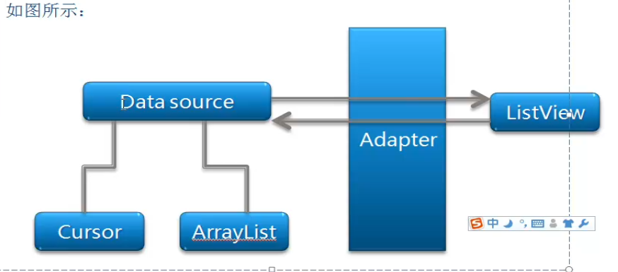

##ListView控件以及它背后的故事

为什么会突然介绍`控件`呢？
- 因为它是`View`，能给人带来最直观的效果，学习的过程是`有点无聊的`，但是能一边做一边看到有意思的效果，那不是蛮有趣的嘛！

### 好的，那什么是`ListView`呢？
官方的解释：
`ListView` is a view group that displays a list of scrollable(**可滚动的**) items. The list items are automatically(**自动的**) inserted to the list using an Adapter that pulls content from a source such as an array or database query and converts each item result into a view that's placed into the list.

解释一下：`ListView`这个`控件`就是用于显示`列表`数据，举个`栗子`:

`为什么`先介绍这个控件呢？因为很重要，又很好玩，大多数常见的app都会使用`ListView`这个控件来显示数据，我们常用的`QQ、人人、G+等等`。


---
## ListView 的有趣属性
>`android:scrollbarStyle`属性及滚动条和分割线覆盖问题
本文主要介绍`android view`的`android:scrollbarStyle`属性意义
`android:scrollbarStyle`可以定义滚动条的样式和位置，可选值有`insideOverlay`、`insideInset`、`outsideOverlay`、`outsideInset`四种。
其中`inside`和`outside`分别表示是否在`view`的`padding`区域内，`overlay`和`inset`表示覆盖在`view`上或是插在`view`后面，所以四种值分别表示：
1.`insideOverlay`：默认值，表示在`padding`区域内并且覆盖在`view`上
2.`insideInset`：表示在`padding`区域内并且插入在`view`后面
3.`outsideOverlay`：表示在`padding`区域外并且覆盖在`view`上，推荐这个
4.`outsideInset`：表示在`padding`区域外并且插入在`view`后面


来讲讲`ListView`的`工作原理`吧。`ListView`控件背后的`Pattern`（模式）,著名的`MVC`。说白了，`ListView`在装载数据时并不是用`ListView.add()`的方法添加数据，而是需要一个`Adapter`对象。其实这么做也是可以的，但是却没有采取这样的做法，因为维护的成本`太高`。


### 来看看他们三个的关系
---

`Model` - 数据模型层，也就是`List<Person>`
`View`  - 视图层,也就是`ListView`
`Controller` -控制层,也就是`Adapter `




来聊聊`MVC`的好处
- 逻辑和界面分离
- 需求在不断修改，加强代码可维护性


 


# 拓展话题
`Observer Pattern `(观察者模式)
你是如何认识报纸和杂志的订阅的？
1.报社的任务，出版报纸
2.向某家报社订阅报纸，只要他们有新报纸出版，就会给你送过来。你要你是他们的订户，就会一直收到报纸。
3.当你不想看报纸的时候，取消订阅，他们就不送了。
4.只要报社还在运营，就一定会有人向他们定报纸或者取消订报纸。

对，就是这么回事。当你意识到报纸的订阅是怎么回事的时候，你也就知道观察者模式是怎么回事了。名字有所不同，报社**改称**为“主题”（Subject），订阅者**改称**为“观察者”。


好的，最后我再附上一些`Android 入门`的视频链接吧
[罗升阳老师的android之旅](http://luo.apkbus.com/)
[张泽华老师的android之旅](http://url.cn/ZDMFpA)
[很好的一篇总结](http://segmentfault.com/blog/stormzhang/1190000000609851)


通过Loader
------
Using a `CursorLoader` is the standard way(**标准的方法**) to query a Cursor as an asynchronous task(**异步任务**) in order to avoid blocking your app's main thread with the query. When the CursorLoader receives the Cursor result, the LoaderCallbacks receives a callback to onLoadFinished(), which is where you update your Adapter(**更新你的adapter**) with the new Cursor and the list view then displays the results.

Although the `CursorLoader` APIs were first introduced in Android 3.0 (API level 11), they are also available in the Support Library so that your app may use them while supporting devices running Android 1.6 or higher.

## 举个栗子
> The following example uses `ListActivity`, which is an activity that includes a ListView as its only layout element by default. It performs a query to the Contacts Provider for a list of names and phone numbers.

> The activity implements the LoaderCallbacks interface in order to use a CursorLoader that dynamically loads the data for the list view.


```
public class ListViewLoader extends ListActivity
        implements LoaderManager.LoaderCallbacks<Cursor> {

    // This is the Adapter being used to display the list's data
    SimpleCursorAdapter mAdapter;

    // These are the Contacts rows that we will retrieve
    static final String[] PROJECTION = new String[] {ContactsContract.Data._ID,
            ContactsContract.Data.DISPLAY_NAME};

    // This is the select criteria
    static final String SELECTION = "((" + 
            ContactsContract.Data.DISPLAY_NAME + " NOTNULL) AND (" +
            ContactsContract.Data.DISPLAY_NAME + " != '' ))";

    @Override
    protected void onCreate(Bundle savedInstanceState) {
        super.onCreate(savedInstanceState);

        // Create a progress bar to display while the list loads
        ProgressBar progressBar = new ProgressBar(this);
        progressBar.setLayoutParams(new LayoutParams(LayoutParams.WRAP_CONTENT,
                LayoutParams.WRAP_CONTENT, Gravity.CENTER));
        progressBar.setIndeterminate(true);
        getListView().setEmptyView(progressBar);

        // Must add the progress bar to the root of the layout
        ViewGroup root = (ViewGroup) findViewById(android.R.id.content);
        root.addView(progressBar);

        // For the cursor adapter, specify which columns go into which views
        String[] fromColumns = {ContactsContract.Data.DISPLAY_NAME};
        int[] toViews = {android.R.id.text1}; // The TextView in simple_list_item_1

        // Create an empty adapter we will use to display the loaded data.
        // We pass null for the cursor, then update it in onLoadFinished()
        mAdapter = new SimpleCursorAdapter(this, 
                android.R.layout.simple_list_item_1, null,
                fromColumns, toViews, 0);
        setListAdapter(mAdapter);

        // Prepare the loader.  Either re-connect with an existing one,
        // or start a new one.
        getLoaderManager().initLoader(0, null, this);
    }

    // Called when a new Loader needs to be created
    public Loader<Cursor> onCreateLoader(int id, Bundle args) {
        // Now create and return a CursorLoader that will take care of
        // creating a Cursor for the data being displayed.
        return new CursorLoader(this, ContactsContract.Data.CONTENT_URI,
                PROJECTION, SELECTION, null, null);
    }

    // Called when a previously created loader has finished loading
    public void onLoadFinished(Loader<Cursor> loader, Cursor data) {
        // Swap the new cursor in.  (The framework will take care of closing the
        // old cursor once we return.)
        mAdapter.swapCursor(data);
    }

    // Called when a previously created loader is reset, making the data unavailable
    public void onLoaderReset(Loader<Cursor> loader) {
        // This is called when the last Cursor provided to onLoadFinished()
        // above is about to be closed.  We need to make sure we are no
        // longer using it.
        mAdapter.swapCursor(null);
    }

    @Override 
    public void onListItemClick(ListView l, View v, int position, long id) {
        // Do something when a list item is clicked
    }
}
```


